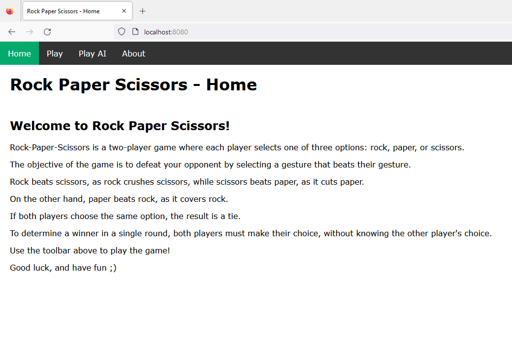

<h1 align="center">PROJET JSFS - Pierre Feuille Ciseaux</h1>

## Informations sur le projet

  L'objectif est de réaliser une version du jeu Pierre-Feuille-Ciseaux dans laquelle s'affrontent deux joueurs connectés dans deux clients différents. 

## Date

  01/03/2023.

## Auteur

  LOUKILI Houssam.

## Instructions
  
  Dans un premier temps, vous devrez cloner le projet de gitlab en utilisant la commande suivante :
  
  SSH:

  * `git clone git@github.com:lifeofhoussam/Rock-Paper-Scissors.git`

  HTTPS:

  * `git clone https://github.com/lifeofhoussam/Rock-Paper-Scissors.git`
  
## Démarrer le projet
  
  Pour pouvoir lancer le projet, il faut que Node.js soit installé sur votre machine.

  Pour les instructions sur l'installation de Node.js voir: [Ici](https://nodejs.org/en/).

  Une fois vous avez Node.js sur votre machine, il faut ce placer dans le dossier `pfc`.
  
  * `cd pfc`.
   
  Puis il faut utiliser la commande suivante pour installer les modules de Node.js:
  
  * `npm install`

  Une fois après avoir installé les modules, vous êtes prêts à lancer le projet:

  Soit en utilisant la commande: 

  * `npm run start`

  Soit en utilisant `nodemon`, vous pouvez l'installer avec la commande `npm install nodemon --global`.

  L'installation de ce module comme `global` permettra d'utiliser la commande pour tous les projets, sans réinstallation.

  * `nodemon`

  Après avoir lancé le serveur, il suffit de visiter l'URL suivante pour jouer au jeu: http://localhost:8080/.

## Capture du jeu

  
